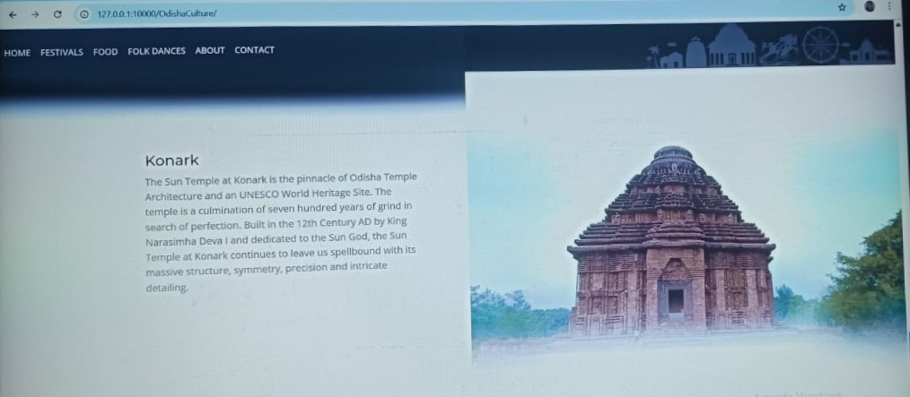

## 🏞️ Odisha Tourism - Django Web Project

A feature-rich Django web application that showcases the cultural heritage, tourist destinations, and traditions of Odisha, India. This project was created as part of a web development initiative using Django, HTML/CSS, and Bootstrap.

---

## ✨ Features

- 🏠 Home, About, and Contact pages
- 📍 Tourist place listings with details and images
- 🧑‍💼 Admin panel for managing content
- 📱 Responsive design using Bootstrap
- 🛠️ Django templating for dynamic pages
- 📷 Image integration for places and attractions

---

## 🌐 Live Demo


## 🛠️ Tech Stack

- **Framework:** Django (Python)
- **Frontend:** HTML5, CSS3, Bootstrap
- **Database:** SQLite3
- **Tools:** Django Admin, VS Code

---

## 📸 Screenshots

**🏠 Homepage**


**📍 Tourist Listings**





**🧑‍💼 Admin Panel**


**📸 All Outputs**


## 🙋‍♀️ Author

**Archana Pati**

**📧 patiarchana.ap@gmail.com**

**🌐 GitHub Profile : Archana98-bit**


## 🚀 Getting Started

### 📦 Prerequisites

- Python 3.8+
- pip (Python package manager)
- Virtualenv (optional but recommended)


### 📄 License
This project is licensed under the MIT License.


### 📁 Setup Instructions

```bash
# 1. Clone the repository
git clone https://github.com/Archana98-bit/OdishaTourism.git

